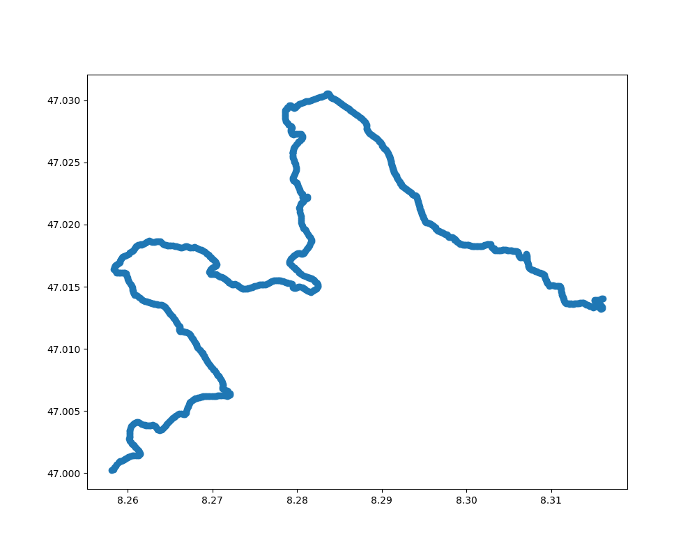

# Visualisierung mit GeoPandas und Folium

Für die Visualisierung unserer Transportdaten hätten wir die Karte auch mit **GeoPandas** erstellen können.  
Dabei werden die Koordinaten aus der CSV-Datei in ein sogenanntes **GeoDataFrame** umgewandelt. Anschliessend kann man die Punkte mit `plot()` direkt darstellen.

## Beispiel mit GeoPandas

```python
track_gdf = gpd.GeoDataFrame(
    track_df,
    geometry=gpd.points_from_xy(track_df["longitude"], track_df["latitude"]),
    crs="EPSG:4326"
)

track_gdf.plot(figsize=(10, 8))
plt.show()
```

Der Vorteil von **GeoPandas** ist, dass sich geografische Daten sehr einfach analysieren und als statische Karte darstellen lassen.  
Für erste Auswertungen oder einfache Diagramme ist das sehr praktisch.

Der Nachteil ist jedoch, dass diese Darstellung **keine echte Hintergrundkarte** enthält.  
Man sieht also nur die Punkte oder Linien, aber nicht direkt Straßen, Orte oder andere Karteninformationen.

Deshalb ist für unser Projekt **Folium** besser geeignet.  
Mit Folium können wir die Messpunkte auf einer **echten interaktiven Karte** anzeigen.  
Dadurch sieht man sofort, wo sich der Transport befand, welche Orte passiert wurden und an welchen Positionen Grenzwertverstöße auftraten.  
Zusätzlich kann man hineinzoomen und einzelne Punkte anklicken.

## Beispiel einer GeoPandas-Darstellung

